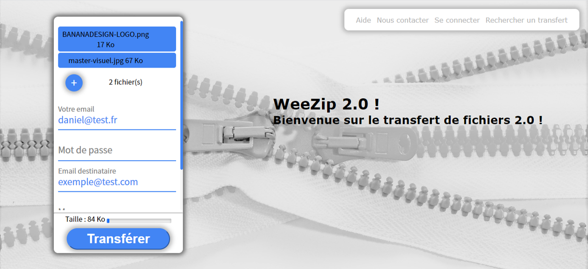
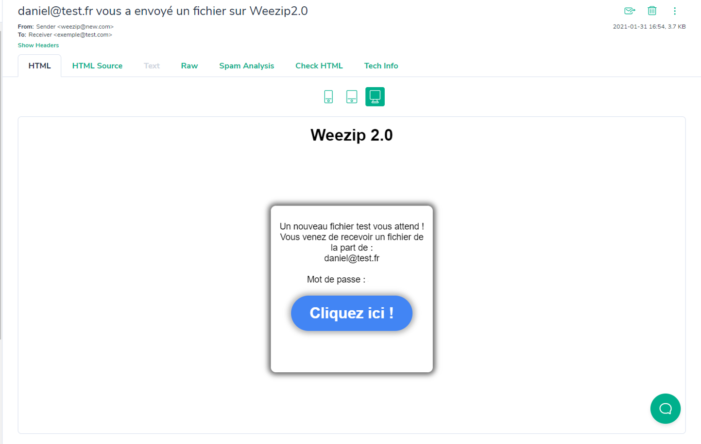
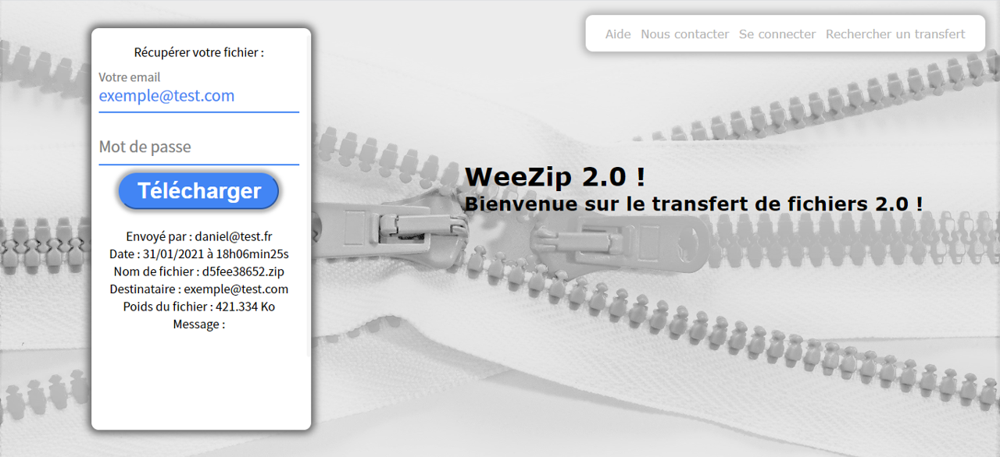

# WeeZip as WeTransfer like

WeeZip is a friendly alternative of the famous WeTransfer website to import and send big files. 
Project was realised in MVC design pattern (Model-View-Controller), almost in PHP and Javascript. 
An Email service was implemented, SwiftMailer from Symfony framework to notify your sender that he has some files for him. 
You can easily add one, or many files with the button Add or directly by drag and drop. 
A filter was added to delete some already added files. 

Pour les français :)
WeeZip est une alternative sympathique au célèbre WeTransfer pour importer et envoyer des gros fichiers. 
Le projet a été réalisé en couche MVC (Model-View-Controller), en PHP, et Javascript. 
Un service d'envoi d'email, SwiftMailer du framework Symfony a été intégré pour envoyer une notification à votre destinataire. 
Vous pouvez facilement importer un ou plusieurs fichiers en cliquant sur le bouton ajouter ou simplement avec un drag and drop. 
Un système de filtre vous permet d'éviter d'envoyer les fichiers en doublons. 

Herewith the different steps of the app :

## 1. Add Files and fill the form

## 2. Validate the form, successfully message

## 3. Your receiver will get a Email with the link

## 4. Now he can log with his email and password

## 5. If downloading doesn't work you can do it manually
